# Comprehensive Testing Strategy for AgroMart Application

## Overview

This document outlines a comprehensive testing strategy to ensure the AgroMart application works perfectly across all components including frontend, backend, and MinIO file storage integration. The strategy addresses current test coverage gaps and establishes robust testing practices for all application layers.

## Architecture

The AgroMart application follows a modern full-stack architecture requiring multi-layered testing:

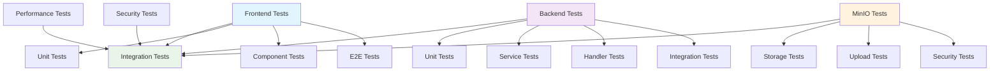

## Frontend Testing Strategy

### Unit Testing Enhancement

**Current State**: Basic smoke tests for auth pages only
**Target State**: Comprehensive component and utility testing

#### Component Testing Requirements

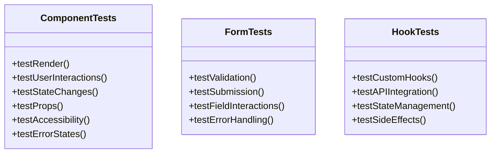

#### Required Test Coverage Areas

| Component Category | Test Coverage Required | Priority |
|-------------------|----------------------|----------|
| Authentication | Login, Register, Password Reset | High |
| Product Management | CRUD Operations, Validation | High |
| File Upload | UI Components, Progress Tracking | High |
| Dashboard | Data Display, Analytics Charts | Medium |
| Forms | Validation, Submission, Error States | High |
| Navigation | Routing, Protected Routes | High |

### End-to-End Testing Enhancement

**Current State**: Basic workflow tests with incomplete file upload coverage
**Target State**: Comprehensive user journey testing

#### E2E Test Scenarios

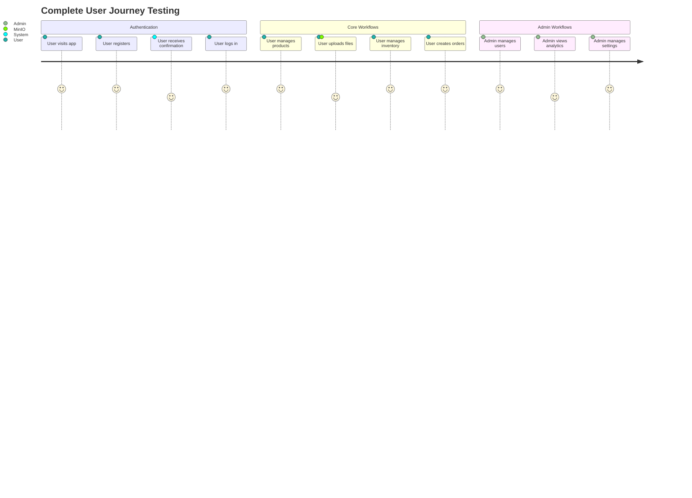

### File Upload Frontend Testing

**Current Gap**: Limited file upload UI testing
**Enhancement Required**: Complete upload workflow testing

#### File Upload Test Matrix

| Test Scenario | Frontend Component | Backend Integration | MinIO Integration |
|--------------|-------------------|-------------------|------------------|
| Single File Upload | ✓ | ✓ | ✓ |
| Multiple File Upload | ✓ | ✓ | ✓ |
| Drag & Drop | ✓ | - | - |
| Progress Tracking | ✓ | ✓ | - |
| Error Handling | ✓ | ✓ | ✓ |
| File Type Validation | ✓ | ✓ | - |
| File Size Validation | ✓ | ✓ | - |
| Image Compression | - | ✓ | ✓ |

## Backend Testing Strategy

### Service Layer Testing Enhancement

**Current State**: Basic API endpoint tests
**Target State**: Comprehensive service and handler testing

#### Service Testing Architecture

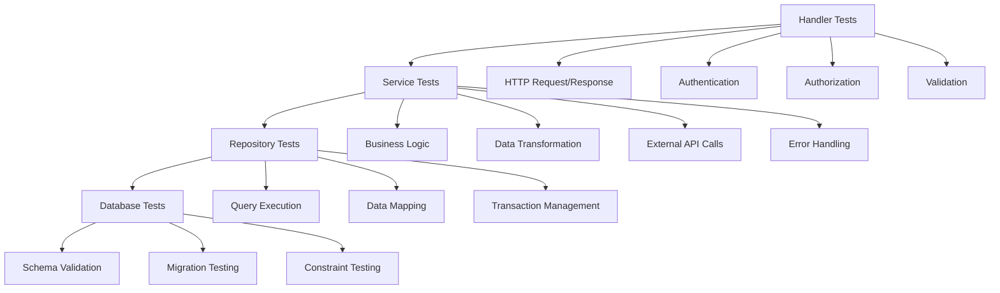

#### Service Testing Requirements

| Service | Current Coverage | Required Enhancement |
|---------|-----------------|---------------------|
| AuthService | Partial | Token refresh, password validation |
| ProductService | Basic | Inventory integration, batch tracking |
| FileUploadService | Missing | Complete MinIO integration testing |
| InventoryService | Missing | Stock calculations, batch expiry |
| AnalyticsService | Missing | Aggregation logic, performance |
| CustomerService | Basic | CRUD operations, validation |
| SupplierService | Basic | Relationship management |

### Integration Testing Enhancement

**Current State**: Limited integration tests
**Target State**: Full system integration coverage

#### Integration Test Scenarios

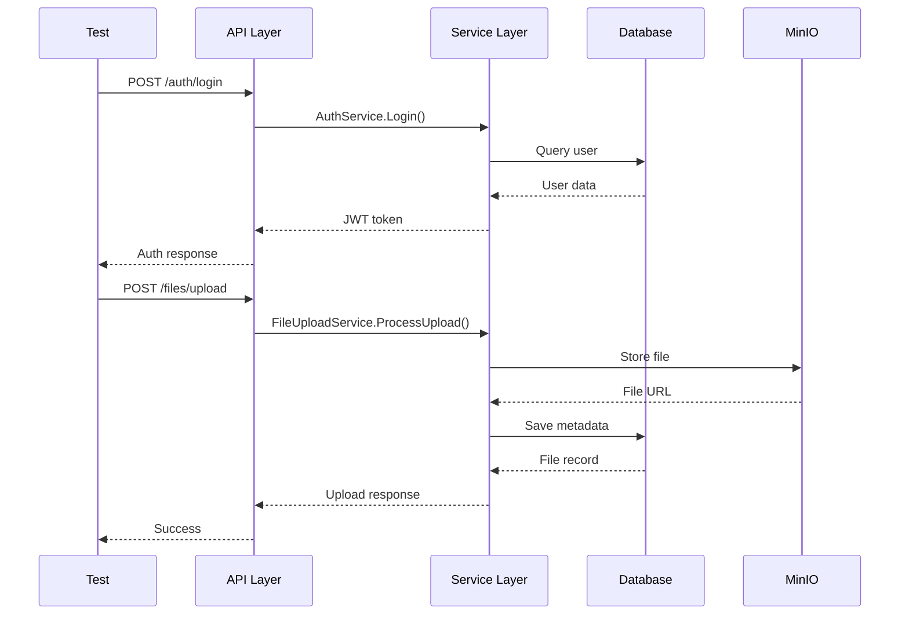

## MinIO Integration Testing

**Current Gap**: No dedicated MinIO testing
**Critical Need**: Complete file storage testing

### MinIO Service Testing

#### Test Coverage Matrix

| Test Category | Test Cases | Implementation Status |
|--------------|------------|----------------------|
| Connection | Client initialization, bucket creation | Missing |
| File Operations | Upload, download, delete, list | Missing |
| Security | Presigned URLs, access control | Missing |
| Error Handling | Network failures, permission errors | Missing |
| Performance | Large files, concurrent uploads | Missing |

#### MinIO Test Implementation Architecture

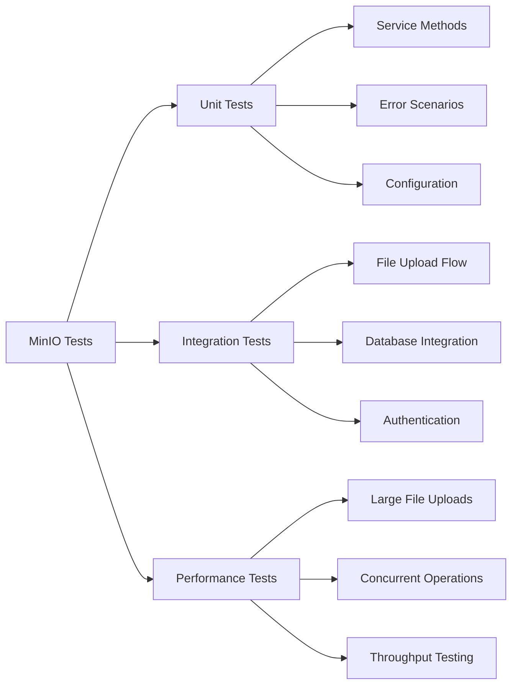

### File Upload Security Testing

#### Security Test Requirements

| Security Aspect | Test Scenarios | Priority |
|-----------------|---------------|----------|
| File Type Validation | Malicious files, executable uploads | High |
| File Size Limits | Oversized files, DoS prevention | High |
| Authentication | Unauthorized upload attempts | High |
| Authorization | Tenant isolation, role-based access | High |
| Virus Scanning | Infected file detection | Medium |

## Performance Testing Enhancement

### Current k6 Testing Analysis

**Existing Coverage**: Basic authentication and CRUD workflows
**Enhancement Needed**: Complete file upload performance testing

#### Performance Test Matrix

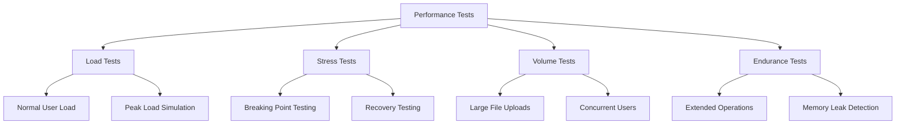

#### File Upload Performance Benchmarks

| File Size | Concurrent Users | Target Upload Time | Success Rate |
|-----------|-----------------|-------------------|--------------|
| 1MB | 10 | < 5 seconds | > 95% |
| 5MB | 5 | < 15 seconds | > 90% |
| 10MB | 3 | < 30 seconds | > 85% |
| 50MB | 1 | < 120 seconds | > 80% |

## Test Data Management

### Test Data Strategy

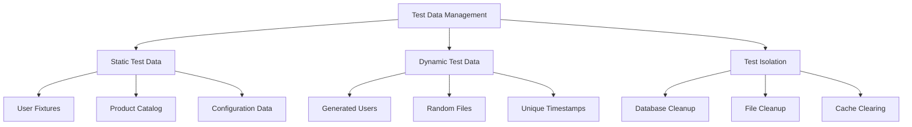

### File Test Data Requirements

| File Type | Test Scenarios | Size Variants |
|-----------|---------------|---------------|
| Images | JPEG, PNG, WebP, SVG | 1KB, 100KB, 1MB, 5MB |
| Documents | PDF, DOCX, TXT | 10KB, 500KB, 2MB |
| Invalid Files | Executables, Scripts | Various |
| Corrupted Files | Truncated, Binary | Various |

## Test Environment Configuration

### Multi-Environment Testing

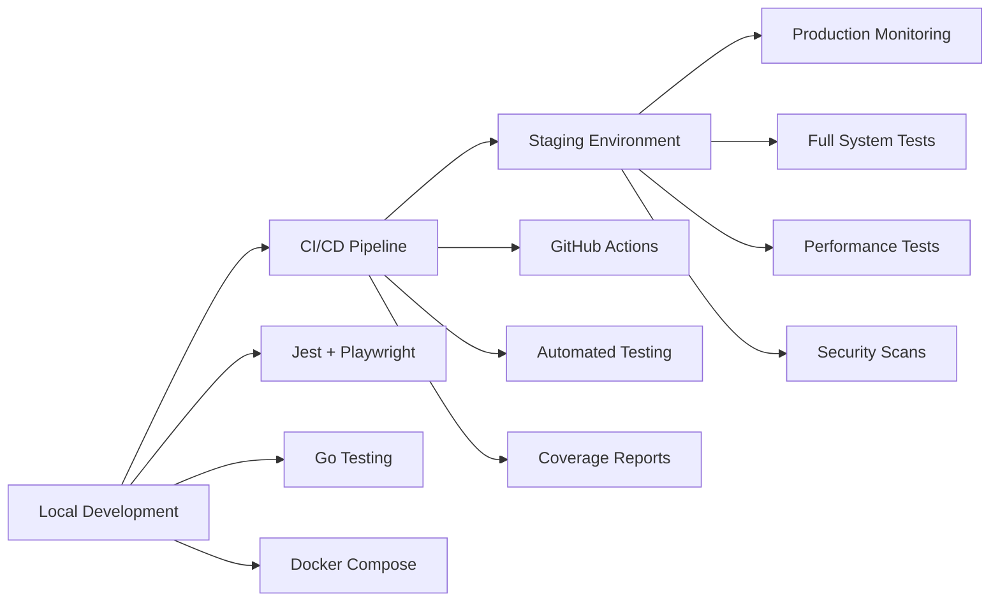

### Environment-Specific Testing

| Environment | Test Types | MinIO Configuration |
|-------------|------------|-------------------|
| Local | Unit, Integration | Local MinIO container |
| CI/CD | Unit, Integration, E2E | Test MinIO instance |
| Staging | Full System, Performance | Production-like MinIO |
| Production | Monitoring, Health Checks | Production MinIO |

## Test Execution Strategy

### Automated Testing Pipeline

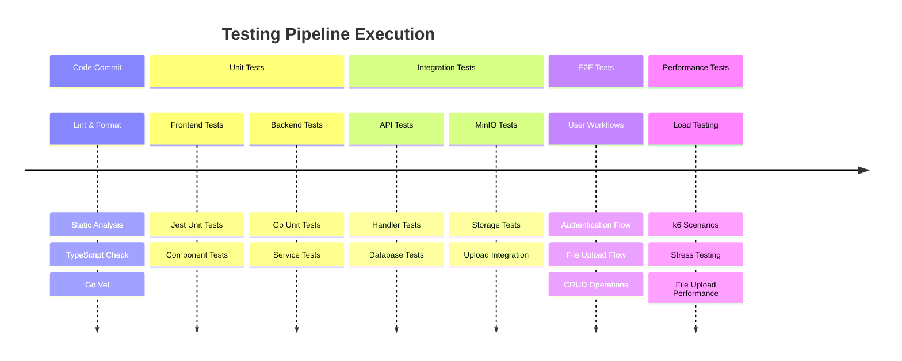

## Coverage Requirements

### Coverage Targets

| Test Type | Current Coverage | Target Coverage | Priority |
|-----------|-----------------|----------------|----------|
| Frontend Unit | 15% | 85% | High |
| Frontend E2E | 40% | 90% | High |
| Backend Unit | 60% | 90% | High |
| Backend Integration | 30% | 85% | High |
| MinIO Integration | 0% | 80% | Critical |
| Performance | 50% | 85% | Medium |

### Quality Gates

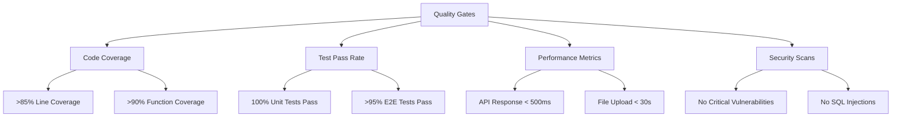

## Implementation Phases

### Phase 1: Foundation (Week 1-2)
- Enhance frontend unit testing infrastructure
- Implement MinIO service testing
- Set up test data management

### Phase 2: Coverage Expansion (Week 3-4)
- Complete backend service testing
- Implement comprehensive E2E scenarios
- Add performance testing for file uploads

### Phase 3: Integration & Optimization (Week 5-6)
- Full system integration testing
- Performance optimization
- Security testing implementation

### Phase 4: Monitoring & Maintenance (Week 7-8)
- Test automation pipeline
- Monitoring and alerting
- Documentation and training

## Success Metrics

### Key Performance Indicators

| Metric | Current State | Target State | Timeline |
|--------|---------------|--------------|----------|
| Test Coverage | 35% | 85% | 6 weeks |
| Test Execution Time | 15 minutes | 10 minutes | 4 weeks |
| Bug Detection Rate | 60% | 90% | 8 weeks |
| Production Incidents | 5/month | 1/month | 8 weeks |
| File Upload Success Rate | 85% | 95% | 4 weeks |

### Quality Assurance Checklist

- [ ] All authentication flows tested end-to-end
- [ ] Complete file upload workflow validation
- [ ] MinIO integration fully tested
- [ ] Performance benchmarks met
- [ ] Security vulnerabilities addressed
- [ ] Multi-tenant isolation verified
- [ ] Database integrity maintained
- [ ] Error handling comprehensive
- [ ] Monitoring and alerting active
- [ ] Documentation complete

