# Full-Stack Test Suite Design

## Overview

This design document outlines the comprehensive test suite implementation for AgroMart's full-stack application, ensuring complete frontend-backend route coverage, comprehensive unit and integration testing, and manual verification workflows. The test suite will guarantee that every backend API endpoint has a corresponding frontend interface and that all routes function correctly without errors.

## Architecture

### Test Framework Architecture

```mermaid
graph TD
    A[Test Suite] --> B[Frontend Tests]
    A --> C[Backend Tests]
    A --> D[Integration Tests]
    A --> E[Manual Verification]
    
    B --> B1[Unit Tests - Jest]
    B --> B2[Component Tests]
    B --> B3[E2E Tests - Playwright]
    B --> B4[API Contract Tests]
    
    C --> C1[Unit Tests - Go testing]
    C --> C2[Service Layer Tests]
    C --> C3[Handler Tests]
    C --> C4[Database Tests]
    
    D --> D1[Frontend-Backend Integration]
    D --> D2[Database Integration]
    D --> D3[Authentication Flow Tests]
    D --> D4[Cross-service Tests]
    
    E --> E1[Route Coverage Verification]
    E --> E2[Manual Testing Checklist]
    E --> E3[Performance Validation]
    E --> E4[Error Handling Verification]
```

### Route Coverage Matrix

#### Backend API Endpoints (Current Implementation)

| Module | Endpoint | Method | Frontend Route | Status |
|--------|----------|--------|----------------|---------|
| **Authentication** | `/api/auth/login` | POST | `/auth/login` | ✅ Exists |
| | `/api/auth/register` | POST | `/auth/register` | ✅ Exists |
| | `/api/auth/logout` | POST | Frontend Context | ✅ Exists |
| | `/api/auth/refresh` | POST | Frontend Context | ✅ Exists |
| | `/api/auth/me` | GET | Frontend Context | ✅ Exists |
| | `/api/auth/password/forgot` | POST | `/auth/forgot-password` | ✅ Exists |
| | `/api/auth/password/reset` | POST | `/auth/reset-password` | ❌ Missing |
| | `/api/password` | PUT | User Settings | ❌ Missing |
| **Health** | `/api/health` | GET | Not needed | ✅ N/A |
| **Products** | `/api/products` | GET | `/products` | ✅ Exists |
| | `/api/products` | POST | `/products/new` | ✅ Exists |
| | `/api/products/:id` | GET | `/products/[id]` | ✅ Exists |
| | `/api/products/:id` | PATCH | `/products/[id]/edit` | ❌ Missing |
| | `/api/products/:id` | DELETE | Delete Dialog | ✅ Exists |
| | `/api/products/search` | GET | Search Component | ✅ Exists |
| | `/api/units` | GET | Form Components | ✅ Exists |
| **Customers** | `/api/customers` | GET | `/customers` | ✅ Exists |
| | `/api/customers` | POST | `/customers/new` | ✅ Exists |
| | `/api/customers/:id` | GET | `/customers/[id]` | ❌ Missing |
| | `/api/customers/:id` | PUT | `/customers/[id]/edit` | ❌ Missing |
| | `/api/customers/:id` | DELETE | Delete Dialog | ✅ Exists |
| | `/api/customers/active` | GET | Form Components | ✅ Exists |
| | `/api/customers/search` | GET | Search Component | ✅ Exists |
| **Suppliers** | `/api/suppliers` | GET | `/suppliers` | ✅ Exists |
| | `/api/suppliers` | POST | `/suppliers/new` | ✅ Exists |
| | `/api/suppliers/:id` | GET | `/suppliers/[id]` | ✅ Exists |
| | `/api/suppliers/:id` | PUT | `/suppliers/[id]/edit` | ❌ Missing |
| | `/api/suppliers/:id` | DELETE | Delete Dialog | ✅ Exists |
| | `/api/suppliers/search` | GET | Search Component | ✅ Exists |
| **Purchase Orders** | `/api/purchase-orders` | GET | `/purchase-orders` | ✅ Exists |
| | `/api/purchase-orders` | POST | `/purchase-orders/new` | ❌ Missing |
| | `/api/purchase-orders/:id` | GET | `/purchase-orders/[id]` | ✅ Exists |
| | `/api/purchase-orders/:id/status` | PUT | Status Dialog | ✅ Exists |
| | `/api/purchase-orders/:id/receive` | POST | Receive Dialog | ✅ Exists |
| | `/api/purchase-orders.csv` | GET | Export Button | ✅ Exists |
| | `/api/reports/product-movement` | GET | Reports Page | ❌ Missing |
| | `/api/reports/supplier-purchase-summary` | GET | Reports Page | ❌ Missing |
| **Sales Orders** | `/api/sales/orders` | GET | `/sales-orders` | ✅ Exists |
| | `/api/sales/orders` | POST | `/sales-orders/new` | ✅ Exists |
| | `/api/sales/orders/:id` | GET | `/sales-orders/[id]` | ✅ Exists |
| | `/api/sales/orders/:id/status` | PUT | Status Dialog | ✅ Exists |
| | `/api/sales/orders/:id/ship` | POST | Ship Dialog | ✅ Exists |
| | `/api/sales/orders.csv` | GET | Export Button | ❌ Missing |
| **Inventory** | `/api/inventory` | GET | `/inventory` | ✅ Exists |
| | `/api/inventory/locations` | GET | Location Components | ❌ Missing |
| | `/api/inventory/low-stock` | GET | Dashboard/Reports | ❌ Missing |
| | `/api/inventory/movements` | GET | Reports Page | ❌ Missing |
| **Batches** | `/api/batches` | GET | `/batches` | ✅ Exists |
| | `/api/batches` | POST | Batch Components | ❌ Missing |
| | `/api/batches/:id` | GET | Batch Details | ❌ Missing |
| | `/api/batches/expiring` | GET | Dashboard/Reports | ❌ Missing |
| **Locations** | `/api/locations` | GET | `/locations` | ✅ Exists |
| | `/api/locations` | POST | `/locations/new` | ✅ Exists |
| | `/api/locations/:id` | GET | `/locations/[id]` | ❌ Missing |
| | `/api/locations/:id` | PUT | Location Edit | ❌ Missing |
| **Analytics** | `/api/analytics/kpis` | GET | Dashboard | ✅ Exists |
| | `/api/analytics/sales` | GET | Analytics Page | ✅ Exists |
| | `/api/analytics/purchases` | GET | Analytics Page | ✅ Exists |
| | `/api/analytics/inventory` | GET | Analytics Page | ✅ Exists |
| **Users** | `/api/users` | GET | `/users` | ✅ Exists |
| | `/api/users` | POST | User Management | ✅ Exists |
| | `/api/users/:id` | GET | User Details | ❌ Missing |
| | `/api/users/:id` | PUT | User Edit | ❌ Missing |
| | `/api/users/:id` | DELETE | User Management | ✅ Exists |
| | `/api/users/search` | GET | User Search | ✅ Exists |
| **Files** | `/api/files/upload` | POST | Upload Components | ✅ Exists |
| | `/api/files` | GET | File Manager | ❌ Missing |
| | `/api/files/:id` | GET | File Access | ✅ Exists |
| | `/api/files/:id` | DELETE | File Management | ❌ Missing |
| | `/api/files/signed-url` | POST | Upload Components | ✅ Exists |
| | `/api/files/:id/url` | GET | File Display | ✅ Exists |
| **Settings** | `/api/settings` | GET | `/settings` | ✅ Exists |
| | `/api/settings` | PUT | Settings Page | ✅ Exists |

## Missing Components Implementation

### Missing Frontend Routes

#### 1. Password Reset Flow
- **Route**: `/auth/reset-password`
- **Purpose**: Complete password reset functionality
- **Backend Endpoint**: `POST /api/auth/password/reset`
- **Implementation**: React form with token validation and password confirmation
- **Components**: `ResetPasswordForm`, `PasswordStrengthIndicator`
- **Validation**: Zod schema with password complexity rules

#### 2. Product Edit Page
- **Route**: `/products/[id]/edit`
- **Purpose**: Edit existing products
- **Backend Endpoint**: `PATCH /api/products/:id`
- **Implementation**: Form with pre-populated data from GET request
- **Components**: `ProductEditForm`, `ImageUploadWidget`
- **Features**: Optimistic updates, change tracking, unsaved changes warning

#### 3. Customer Detail and Edit Pages
- **Route**: `/customers/[id]`
- **Route**: `/customers/[id]/edit`
- **Backend Endpoints**: `GET /api/customers/:id`, `PUT /api/customers/:id`
- **Implementation**: Detail view with edit modal/page
- **Components**: `CustomerDetailView`, `CustomerEditForm`, `CustomerOrderHistory`
- **Features**: Related orders display, contact information management

#### 4. Supplier Edit Page
- **Route**: `/suppliers/[id]/edit`
- **Backend Endpoint**: `PUT /api/suppliers/:id`
- **Implementation**: Comprehensive supplier information editor
- **Components**: `SupplierEditForm`, `ContactPersonManager`, `PaymentTermsEditor`
- **Features**: Multiple contact persons, payment terms configuration

#### 5. Purchase Orders Creation
- **Route**: `/purchase-orders/new`
- **Backend Endpoint**: `POST /api/purchase-orders`
- **Implementation**: Multi-step form with product selection
- **Components**: `PurchaseOrderForm`, `ProductSelector`, `OrderItemsTable`
- **Features**: Dynamic line items, total calculations, supplier filtering

#### 6. Reports Module
- **Route**: `/reports`
- **Sub-routes**: `/reports/product-movement`, `/reports/supplier-summary`
- **Backend Endpoints**: Various report endpoints
- **Implementation**: Dashboard with interactive charts and filters
- **Components**: `ReportsLayout`, `ProductMovementChart`, `SupplierSummaryTable`
- **Features**: Date range filtering, CSV export, real-time updates

#### 7. Batch Management
- **Route**: `/batches/new`
- **Route**: `/batches/[id]`
- **Backend Endpoints**: Batch management endpoints
- **Implementation**: Batch creation and tracking interface
- **Components**: `BatchForm`, `BatchTimeline`, `ExpiryTracker`
- **Features**: Expiry date management, lot number generation, QR code support

#### 8. Location Details
- **Route**: `/locations/[id]`
- **Backend Endpoint**: `GET /api/locations/:id`
- **Implementation**: Location overview with inventory distribution
- **Components**: `LocationDetailView`, `InventoryByLocation`, `LocationMap`
- **Features**: Inventory levels per location, transfer management

#### 9. User Detail Pages
- **Route**: `/users/[id]`
- **Route**: `/users/[id]/edit`
- **Backend Endpoints**: User management endpoints
- **Implementation**: User profile and permission management
- **Components**: `UserProfile`, `RoleManager`, `PermissionMatrix`
- **Features**: Role-based access control, activity logging

#### 10. File Management Interface
- **Route**: `/files`
- **Purpose**: File browser and management
- **Backend Endpoints**: File management endpoints
- **Implementation**: File browser with upload, preview, and organization
- **Components**: `FileBrowser`, `FileUploader`, `FilePreview`, `FolderManager`
- **Features**: Drag-and-drop upload, file organization, permission management

### Missing Backend Endpoints

#### 1. Enhanced Analytics Endpoints
- **Endpoint**: `GET /api/analytics/trends`
- **Purpose**: Time-series trend analysis
- **Implementation**: Statistical analysis with configurable time periods
- **Response**: Trend data with growth percentages and forecasts

#### 2. Advanced Inventory Endpoints
- **Endpoint**: `GET /api/inventory/movements`
- **Purpose**: Detailed inventory movement tracking
- **Implementation**: Comprehensive audit trail with filtering capabilities
- **Features**: Movement history, stock adjustments, transfer tracking

#### 3. Batch Management Endpoints
- **Endpoint**: `POST /api/batches`
- **Endpoint**: `GET /api/batches/:id`
- **Endpoint**: `PUT /api/batches/:id`
- **Endpoint**: `GET /api/batches/expiring`
- **Purpose**: Complete batch lifecycle management
- **Implementation**: Batch creation, tracking, and expiry monitoring
- **Features**: QR code generation, expiry alerts, lot number management

#### 4. Enhanced Reports Endpoints
- **Endpoint**: `GET /api/reports/product-movement`
- **Endpoint**: `GET /api/reports/supplier-summary`
- **Endpoint**: `GET /api/reports/inventory-valuation`
- **Endpoint**: `GET /api/reports/sales-forecast`
- **Purpose**: Comprehensive business intelligence
- **Implementation**: Complex aggregations with filtering and export capabilities
- **Features**: Real-time calculations, multi-format export, scheduled reports

#### 5. Location Management Enhancement
- **Endpoint**: `PUT /api/locations/:id`
- **Endpoint**: `DELETE /api/locations/:id`
- **Endpoint**: `GET /api/locations/:id/inventory`
- **Purpose**: Complete location lifecycle management
- **Implementation**: Location CRUD with inventory tracking
- **Features**: Hierarchical locations, inventory distribution, transfer management

#### 6. User Management Enhancement
- **Endpoint**: `GET /api/users/:id`
- **Endpoint**: `PUT /api/users/:id`
- **Endpoint**: `GET /api/users/:id/activity`
- **Purpose**: Enhanced user administration
- **Implementation**: User profile management with activity tracking
- **Features**: Permission management, activity logs, profile customization

#### 7. File Management Enhancement
- **Endpoint**: `GET /api/files/folders`
- **Endpoint**: `POST /api/files/folders`
- **Endpoint**: `PUT /api/files/:id/move`
- **Purpose**: Organized file management
- **Implementation**: Folder structure with file organization
- **Features**: Folder hierarchy, file categorization, bulk operations

#### 8. Notification System
- **Endpoint**: `GET /api/notifications`
- **Endpoint**: `POST /api/notifications/mark-read`
- **Endpoint**: `GET /api/notifications/preferences`
- **Purpose**: Real-time notification system
- **Implementation**: WebSocket-based notifications with preferences
- **Features**: Real-time alerts, notification preferences, delivery tracking

#### 9. Export Enhancement
- **Endpoint**: `GET /api/export/customers.csv`
- **Endpoint**: `GET /api/export/suppliers.csv`
- **Endpoint**: `GET /api/export/inventory.csv`
- **Purpose**: Comprehensive data export
- **Implementation**: Streaming CSV exports with filtering
- **Features**: Large dataset handling, custom field selection, scheduled exports

#### 10. Advanced Search
- **Endpoint**: `GET /api/search/global`
- **Endpoint**: `GET /api/search/suggestions`
- **Purpose**: Global search across all entities
- **Implementation**: Full-text search with relevance scoring
- **Features**: Auto-complete, search history, saved searches

### Implementation Strategy

#### Frontend Implementation Plan

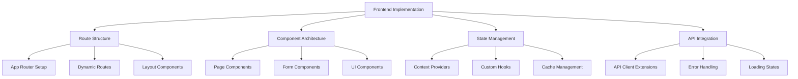

#### Backend Implementation Plan

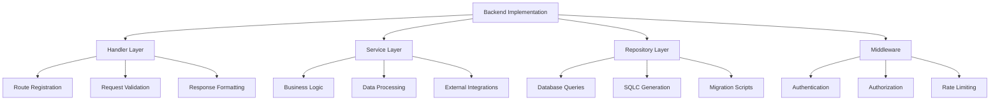

## Detailed Component Specifications

### Frontend Component Architecture

#### Authentication Components

##### Reset Password Page (`/auth/reset-password`)
```typescript
// Component Structure
interface ResetPasswordPageProps {
  token: string;
}

components:
- ResetPasswordForm
- PasswordStrengthIndicator
- TokenValidation
- SuccessConfirmation

features:
- Token validation on page load
- Password strength requirements
- Confirmation password matching
- Automatic redirect on success
- Error handling for expired tokens
```

#### Product Management Components

##### Product Edit Page (`/products/[id]/edit`)
```typescript
// Component Structure
interface ProductEditPageProps {
  productId: string;
}

components:
- ProductEditForm
- ImageUploadWidget
- CategorySelector
- UnitSelector
- PriceCalculator
- StockLevelIndicator

features:
- Pre-populated form from existing data
- Image upload with preview
- Real-time price calculations
- Stock level warnings
- Unsaved changes detection
- Optimistic updates
```

#### Customer Management Components

##### Customer Detail View (`/customers/[id]`)
```typescript
// Component Structure
interface CustomerDetailProps {
  customerId: string;
}

components:
- CustomerInfoCard
- ContactDetailsSection
- OrderHistoryTable
- PaymentHistorySection
- ActionButtons
- EditCustomerModal

features:
- Complete customer information display
- Order history with pagination
- Payment status tracking
- Quick edit functionality
- Contact management
- Activity timeline
```

##### Customer Edit Form (`/customers/[id]/edit`)
```typescript
// Component Structure
components:
- CustomerEditForm
- ContactPersonManager
- AddressEditor
- PaymentPreferences
- DocumentUploader

features:
- Multi-step form navigation
- Address validation
- Contact person management
- Document attachment
- Credit limit management
- Payment terms configuration
```

#### Order Management Components

##### Purchase Order Creation (`/purchase-orders/new`)
```typescript
// Component Structure
components:
- PurchaseOrderForm
- SupplierSelector
- ProductSelector
- OrderItemsTable
- TotalCalculator
- DeliveryScheduler

features:
- Multi-step order creation
- Dynamic line item management
- Real-time total calculations
- Supplier filtering
- Product search integration
- Delivery date scheduling
- Tax calculations
```

#### File Management Components

##### File Browser (`/files`)
```typescript
// Component Structure
components:
- FileBrowser
- FileUploader
- FilePreview
- FolderManager
- FilePermissions
- BulkOperations

features:
- Drag-and-drop upload
- Folder navigation
- File preview modal
- Bulk selection
- Permission management
- Search and filtering
- File sharing links
```

### Backend Service Architecture

#### Enhanced Analytics Service

##### Trend Analysis Service
```go
// Service Interface
type TrendAnalysisService interface {
    GetSalesTrends(ctx context.Context, params TrendParams) (*TrendData, error)
    GetInventoryTrends(ctx context.Context, params TrendParams) (*TrendData, error)
    GetCustomerTrends(ctx context.Context, params TrendParams) (*TrendData, error)
    GenerateForecast(ctx context.Context, params ForecastParams) (*ForecastData, error)
}

// Implementation Features
- Time-series analysis
- Statistical calculations
- Trend detection algorithms
- Forecasting models
- Configurable time periods
- Multi-dimensional analysis
```

#### Batch Management Service

##### Batch Lifecycle Service
```go
// Service Interface
type BatchService interface {
    CreateBatch(ctx context.Context, params CreateBatchParams) (*Batch, error)
    GetBatch(ctx context.Context, id uuid.UUID) (*Batch, error)
    UpdateBatch(ctx context.Context, params UpdateBatchParams) (*Batch, error)
    GetExpiringBatches(ctx context.Context, days int) ([]*Batch, error)
    GenerateQRCode(ctx context.Context, batchID uuid.UUID) ([]byte, error)
    TrackMovement(ctx context.Context, params MovementParams) error
}

// Implementation Features
- Batch lifecycle management
- QR code generation
- Expiry monitoring
- Movement tracking
- Lot number generation
- Serial number management
```

#### Enhanced Reports Service

##### Business Intelligence Service
```go
// Service Interface
type ReportsService interface {
    GetProductMovementReport(ctx context.Context, params ReportParams) (*MovementReport, error)
    GetSupplierSummaryReport(ctx context.Context, params ReportParams) (*SupplierReport, error)
    GetInventoryValuationReport(ctx context.Context, params ReportParams) (*ValuationReport, error)
    GenerateSalesForecast(ctx context.Context, params ForecastParams) (*ForecastReport, error)
    ExportToCSV(ctx context.Context, reportType string, params ReportParams) (io.Reader, error)
    ScheduleReport(ctx context.Context, params ScheduleParams) error
}

// Implementation Features
- Complex data aggregations
- Multi-format exports
- Scheduled report generation
- Real-time calculations
- Customizable parameters
- Performance optimization
```

#### Notification Service

##### Real-time Notification System
```go
// Service Interface
type NotificationService interface {
    SendNotification(ctx context.Context, notification *Notification) error
    GetUserNotifications(ctx context.Context, userID uuid.UUID) ([]*Notification, error)
    MarkAsRead(ctx context.Context, notificationID uuid.UUID) error
    UpdatePreferences(ctx context.Context, userID uuid.UUID, prefs *NotificationPreferences) error
    GetPreferences(ctx context.Context, userID uuid.UUID) (*NotificationPreferences, error)
}

// Implementation Features
- WebSocket integration
- Push notifications
- Email notifications
- SMS notifications
- Preference management
- Delivery tracking
```

### Database Schema Extensions

#### Batch Management Tables
```sql
-- Batches table
CREATE TABLE batches (
    id UUID PRIMARY KEY DEFAULT gen_random_uuid(),
    tenant_id UUID NOT NULL REFERENCES tenants(id),
    product_id UUID NOT NULL REFERENCES products(id),
    batch_number VARCHAR(100) NOT NULL,
    lot_number VARCHAR(100),
    manufacture_date DATE,
    expiry_date DATE,
    quantity INTEGER NOT NULL DEFAULT 0,
    unit_cost INTEGER NOT NULL DEFAULT 0,
    qr_code TEXT,
    notes TEXT,
    created_at TIMESTAMPTZ NOT NULL DEFAULT NOW(),
    updated_at TIMESTAMPTZ NOT NULL DEFAULT NOW(),
    created_by UUID REFERENCES users(id)
);

-- Batch movements table
CREATE TABLE batch_movements (
    id UUID PRIMARY KEY DEFAULT gen_random_uuid(),
    tenant_id UUID NOT NULL REFERENCES tenants(id),
    batch_id UUID NOT NULL REFERENCES batches(id),
    movement_type VARCHAR(50) NOT NULL, -- 'in', 'out', 'transfer', 'adjustment'
    quantity INTEGER NOT NULL,
    from_location_id UUID REFERENCES locations(id),
    to_location_id UUID REFERENCES locations(id),
    reference_id UUID, -- Reference to order, transfer, etc.
    reference_type VARCHAR(50), -- 'purchase_order', 'sales_order', 'transfer'
    notes TEXT,
    created_at TIMESTAMPTZ NOT NULL DEFAULT NOW(),
    created_by UUID REFERENCES users(id)
);
```

#### Notification Tables
```sql
-- Notifications table
CREATE TABLE notifications (
    id UUID PRIMARY KEY DEFAULT gen_random_uuid(),
    tenant_id UUID NOT NULL REFERENCES tenants(id),
    user_id UUID NOT NULL REFERENCES users(id),
    title VARCHAR(255) NOT NULL,
    message TEXT NOT NULL,
    type VARCHAR(50) NOT NULL, -- 'info', 'warning', 'error', 'success'
    category VARCHAR(50), -- 'inventory', 'orders', 'system'
    is_read BOOLEAN NOT NULL DEFAULT FALSE,
    action_url TEXT,
    metadata JSONB,
    created_at TIMESTAMPTZ NOT NULL DEFAULT NOW(),
    read_at TIMESTAMPTZ
);

-- Notification preferences table
CREATE TABLE notification_preferences (
    id UUID PRIMARY KEY DEFAULT gen_random_uuid(),
    tenant_id UUID NOT NULL REFERENCES tenants(id),
    user_id UUID NOT NULL REFERENCES users(id),
    category VARCHAR(50) NOT NULL,
    email_enabled BOOLEAN NOT NULL DEFAULT TRUE,
    push_enabled BOOLEAN NOT NULL DEFAULT TRUE,
    sms_enabled BOOLEAN NOT NULL DEFAULT FALSE,
    frequency VARCHAR(50) NOT NULL DEFAULT 'immediate', -- 'immediate', 'daily', 'weekly'
    created_at TIMESTAMPTZ NOT NULL DEFAULT NOW(),
    updated_at TIMESTAMPTZ NOT NULL DEFAULT NOW()
);
```

#### Reports and Analytics Tables
```sql
-- Scheduled reports table
CREATE TABLE scheduled_reports (
    id UUID PRIMARY KEY DEFAULT gen_random_uuid(),
    tenant_id UUID NOT NULL REFERENCES tenants(id),
    name VARCHAR(255) NOT NULL,
    report_type VARCHAR(100) NOT NULL,
    parameters JSONB,
    schedule_cron VARCHAR(100) NOT NULL,
    recipients TEXT[] NOT NULL,
    format VARCHAR(20) NOT NULL DEFAULT 'csv',
    is_active BOOLEAN NOT NULL DEFAULT TRUE,
    last_run_at TIMESTAMPTZ,
    next_run_at TIMESTAMPTZ,
    created_at TIMESTAMPTZ NOT NULL DEFAULT NOW(),
    created_by UUID REFERENCES users(id)
);

-- Report execution log
CREATE TABLE report_executions (
    id UUID PRIMARY KEY DEFAULT gen_random_uuid(),
    scheduled_report_id UUID REFERENCES scheduled_reports(id),
    status VARCHAR(50) NOT NULL, -- 'pending', 'running', 'completed', 'failed'
    started_at TIMESTAMPTZ NOT NULL DEFAULT NOW(),
    completed_at TIMESTAMPTZ,
    error_message TEXT,
    file_url TEXT,
    file_size INTEGER
);
```

### Route Implementation Roadmap

#### Phase 1: Critical Route Completion (Week 1-2)

##### Frontend Routes - High Priority

1. **Password Reset Page** (`/auth/reset-password`)
   ```typescript
   // File: apps/client/src/app/auth/reset-password/page.tsx
   - Token validation component
   - Password form with strength indicator
   - Success/error state management
   - Integration with backend reset endpoint
   ```

2. **Product Edit Page** (`/products/[id]/edit`)
   ```typescript
   // File: apps/client/src/app/products/[id]/edit/page.tsx
   - Dynamic route implementation
   - Form pre-population from API
   - Image upload integration
   - Optimistic updates with error handling
   ```

3. **Customer Detail View** (`/customers/[id]`)
   ```typescript
   // File: apps/client/src/app/customers/[id]/page.tsx
   - Customer information display
   - Order history integration
   - Quick action buttons
   - Edit modal integration
   ```

4. **Purchase Order Creation** (`/purchase-orders/new`)
   ```typescript
   // File: apps/client/src/app/purchase-orders/new/page.tsx
   - Multi-step form implementation
   - Product selection with search
   - Real-time calculations
   - Supplier integration
   ```

##### Backend Endpoints - High Priority

1. **Enhanced Customer Endpoints**
   ```go
   // File: apps/server/customers/handlers.go
   // GET /api/customers/:id - Individual customer details
   func (h *CustomerHandler) GetCustomer(c echo.Context) error
   
   // PUT /api/customers/:id - Update customer information
   func (h *CustomerHandler) UpdateCustomer(c echo.Context) error
   ```

2. **Product Update Endpoint**
   ```go
   // File: apps/server/products/handlers.go
   // PATCH /api/products/:id - Partial product updates
   func (h *ProductHandler) PatchProduct(c echo.Context) error
   ```

3. **Purchase Order Creation**
   ```go
   // File: apps/server/purchase_orders/handlers.go
   // POST /api/purchase-orders - Create new purchase order
   func (h *Handler) CreatePurchaseOrder(c echo.Context) error
   ```

#### Phase 2: Enhanced Functionality (Week 3-4)

##### Frontend Routes - Medium Priority

1. **Supplier Edit Page** (`/suppliers/[id]/edit`)
   ```typescript
   // File: apps/client/src/app/suppliers/[id]/edit/page.tsx
   - Comprehensive supplier form
   - Contact person management
   - Payment terms configuration
   - Document management
   ```

2. **Location Details** (`/locations/[id]`)
   ```typescript
   // File: apps/client/src/app/locations/[id]/page.tsx
   - Location overview
   - Inventory distribution
   - Transfer management
   - Visual layout representation
   ```

3. **User Management Pages**
   ```typescript
   // File: apps/client/src/app/users/[id]/page.tsx
   // File: apps/client/src/app/users/[id]/edit/page.tsx
   - User profile display
   - Role management
   - Permission matrix
   - Activity timeline
   ```

##### Backend Endpoints - Medium Priority

1. **Enhanced Location Management**
   ```go
   // File: apps/server/locations/handlers.go
   // GET /api/locations/:id - Location details
   // PUT /api/locations/:id - Update location
   // GET /api/locations/:id/inventory - Location inventory
   ```

2. **User Management Enhancement**
   ```go
   // File: apps/server/users/handlers.go
   // GET /api/users/:id - User details
   // PUT /api/users/:id - Update user
   // GET /api/users/:id/activity - User activity log
   ```

3. **Supplier Management**
   ```go
   // File: apps/server/suppliers/handlers.go
   // PUT /api/suppliers/:id - Update supplier
   // GET /api/suppliers/:id/orders - Supplier orders
   ```

#### Phase 3: Advanced Features (Week 5-6)

##### Batch Management System

1. **Frontend Implementation**
   ```typescript
   // File: apps/client/src/app/batches/page.tsx
   // File: apps/client/src/app/batches/new/page.tsx
   // File: apps/client/src/app/batches/[id]/page.tsx
   
   components:
   - BatchList with expiry indicators
   - BatchForm with QR code generation
   - BatchTimeline for movement tracking
   - ExpiryAlerts dashboard widget
   ```

2. **Backend Implementation**
   ```go
   // File: apps/server/batches/handlers.go
   // File: apps/server/batches/service.go
   
   endpoints:
   - POST /api/batches - Create batch
   - GET /api/batches/:id - Batch details
   - PUT /api/batches/:id - Update batch
   - GET /api/batches/expiring - Expiring batches
   - POST /api/batches/:id/qr - Generate QR code
   ```

##### Reports and Analytics Module

1. **Frontend Implementation**
   ```typescript
   // File: apps/client/src/app/reports/page.tsx
   // File: apps/client/src/app/reports/product-movement/page.tsx
   // File: apps/client/src/app/reports/supplier-summary/page.tsx
   
   components:
   - ReportsLayout with navigation
   - InteractiveCharts with filters
   - ExportControls for CSV/PDF
   - DateRangePicker for filtering
   ```

2. **Backend Implementation**
   ```go
   // File: apps/server/reports/handlers.go
   // File: apps/server/reports/service.go
   
   endpoints:
   - GET /api/reports/product-movement
   - GET /api/reports/supplier-summary
   - GET /api/reports/inventory-valuation
   - GET /api/reports/sales-forecast
   ```

##### File Management System

1. **Frontend Implementation**
   ```typescript
   // File: apps/client/src/app/files/page.tsx
   
   components:
   - FileBrowser with folder navigation
   - FileUploader with drag-and-drop
   - FilePreview modal
   - BulkOperations toolbar
   - PermissionManager
   ```

2. **Backend Implementation**
   ```go
   // File: apps/server/files/handlers.go
   
   endpoints:
   - GET /api/files/folders - List folders
   - POST /api/files/folders - Create folder
   - PUT /api/files/:id/move - Move file
   - GET /api/files/:id/permissions - File permissions
   - PUT /api/files/:id/permissions - Update permissions
   ```

### Technical Implementation Specifications

#### Frontend Architecture Standards

##### Component Structure
```typescript
// Standard component structure
export interface ComponentProps {
  // Props interface
}

export default function Component({ }: ComponentProps) {
  // Hooks
  // State management
  // Event handlers
  // Effects
  
  return (
    <DashboardLayout>
      {/* Component JSX */}
    </DashboardLayout>
  );
}
```

##### Form Implementation Pattern
```typescript
// Standard form pattern
import { useForm } from 'react-hook-form';
import { zodResolver } from '@hookform/resolvers/zod';
import { z } from 'zod';

const formSchema = z.object({
  // Schema definition
});

type FormData = z.infer<typeof formSchema>;

export default function FormComponent() {
  const form = useForm<FormData>({
    resolver: zodResolver(formSchema),
    defaultValues: {
      // Default values
    },
  });
  
  const onSubmit = async (data: FormData) => {
    // Form submission logic
  };
  
  return (
    <Form {...form}>
      <form onSubmit={form.handleSubmit(onSubmit)}>
        {/* Form fields */}
      </form>
    </Form>
  );
}
```

##### API Integration Pattern
```typescript
// Standard API integration
import useSWR from 'swr';
import { apiClient } from '@/lib/api';

export default function DataComponent() {
  const { data, error, isLoading, mutate } = useSWR(
    ['endpoint', params],
    () => apiClient.endpoint.method(params),
    {
      revalidateOnFocus: false,
      errorRetryCount: 3,
    }
  );
  
  if (isLoading) return <LoadingSkeleton />;
  if (error) return <ErrorState error={error} />;
  
  return (
    <div>
      {/* Component content */}
    </div>
  );
}
```

#### Backend Architecture Standards

##### Handler Implementation Pattern
```go
// Standard handler pattern
func (h *Handler) EndpointHandler(c echo.Context) error {
    // 1. Extract and validate parameters
    var req RequestStruct
    if err := c.Bind(&req); err != nil {
        return echo.NewHTTPError(http.StatusBadRequest, "invalid request body")
    }
    
    // 2. Validate request
    if err := validation.Validate(req); err != nil {
        return echo.NewHTTPError(http.StatusBadRequest, err.Error())
    }
    
    // 3. Extract tenant context
    tenantID, err := getTenantID(c)
    if err != nil {
        return echo.NewHTTPError(http.StatusUnauthorized, "invalid tenant")
    }
    
    // 4. Call service layer
    result, err := h.service.MethodName(c.Request().Context(), serviceParams)
    if err != nil {
        return handleServiceError(err)
    }
    
    // 5. Return response
    return c.JSON(http.StatusOK, map[string]interface{}{
        "success": true,
        "data":    result,
        "message": "Operation successful",
    })
}
```

##### Service Implementation Pattern
```go
// Standard service pattern
type Service struct {
    db *pgxpool.Pool
    q  *db.Queries
}

func (s *Service) MethodName(ctx context.Context, params ServiceParams) (*Result, error) {
    // 1. Begin transaction if needed
    tx, err := s.db.Begin(ctx)
    if err != nil {
        return nil, err
    }
    defer tx.Rollback(ctx)
    
    // 2. Execute business logic
    result, err := s.q.WithTx(tx).QueryMethod(ctx, queryParams)
    if err != nil {
        return nil, err
    }
    
    // 3. Additional processing
    processedResult := processResult(result)
    
    // 4. Commit transaction
    if err := tx.Commit(ctx); err != nil {
        return nil, err
    }
    
    return processedResult, nil
}
```

##### Database Query Pattern
```sql
-- Standard query pattern
-- name: GetEntityWithRelations :one
SELECT 
    e.*,
    r.related_field
FROM entities e
LEFT JOIN related_table r ON e.id = r.entity_id
WHERE e.tenant_id = $1 
  AND e.id = $2
  AND e.deleted_at IS NULL;

-- name: ListEntitiesWithPagination :many
SELECT *
FROM entities
WHERE tenant_id = $1
  AND deleted_at IS NULL
  AND ($3::text IS NULL OR name ILIKE '%' || $3 || '%')
ORDER BY created_at DESC
LIMIT $4 OFFSET $5;
```

## Testing Strategy

### Frontend Testing Framework

#### Unit Tests (Jest + React Testing Library)

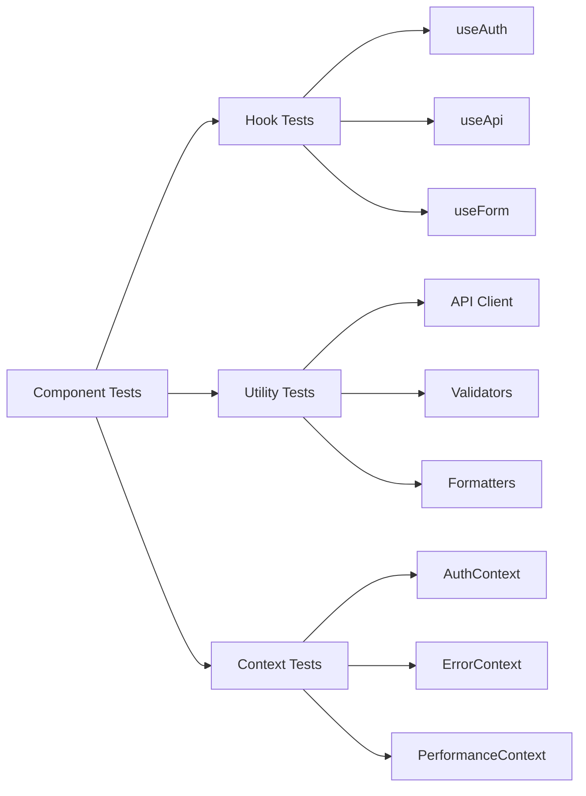

#### Integration Tests (Playwright)

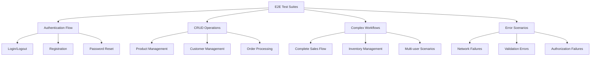

### Backend Testing Framework

#### Unit Tests (Go testing + testify)

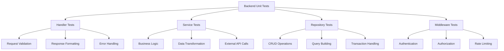

#### Integration Tests

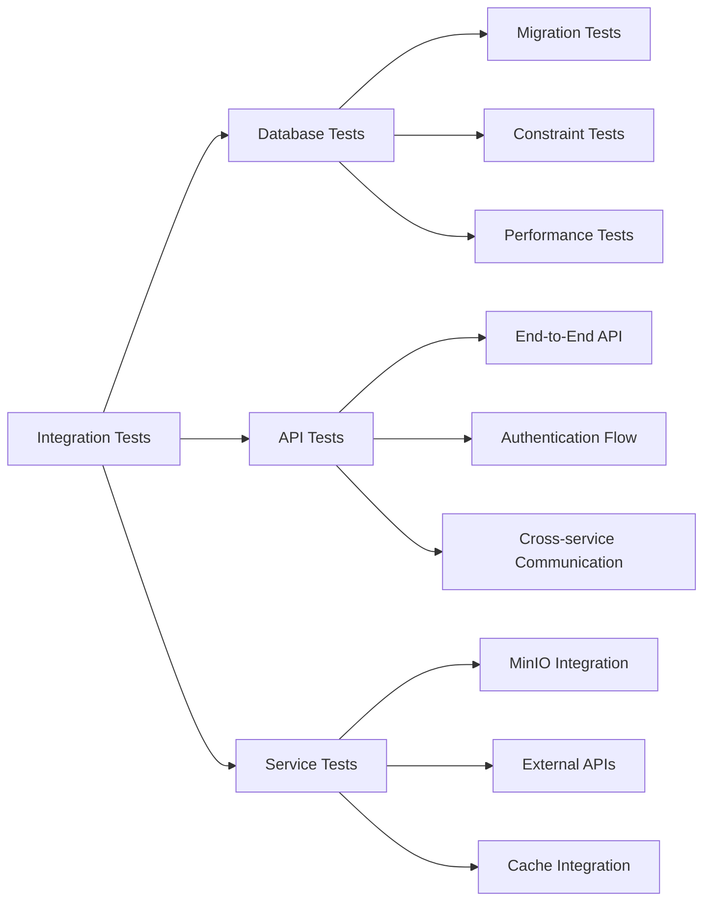

### Test Data Management

#### Test Data Strategy

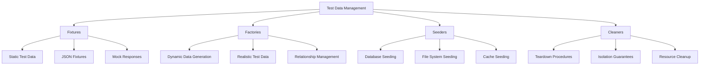

## Test Implementation Framework

### Frontend Test Structure

#### Component Test Template
```typescript
// Template for component tests
describe('ComponentName', () => {
  // Setup and teardown
  beforeEach(() => {
    // Mock implementations
  });

  describe('Rendering', () => {
    // Rendering tests
  });

  describe('User Interactions', () => {
    // Interaction tests
  });

  describe('API Integration', () => {
    // API contract tests
  });

  describe('Error Handling', () => {
    // Error scenario tests
  });

  describe('Accessibility', () => {
    // A11y tests
  });
});
```

#### API Contract Tests
```typescript
// Template for API contract tests
describe('API Endpoints', () => {
  describe('GET /api/resource', () => {
    test('should return 200 with valid data structure');
    test('should handle authentication errors');
    test('should handle validation errors');
    test('should handle server errors');
  });
});
```

### Backend Test Structure

#### Handler Test Template
```go
// Template for handler tests
func TestHandlerName(t *testing.T) {
  tests := []struct {
    name           string
    setupMock      func()
    request        interface{}
    expectedStatus int
    expectedBody   interface{}
    expectError    bool
  }{
    // Test cases
  }

  for _, tt := range tests {
    t.Run(tt.name, func(t *testing.T) {
      // Test implementation
    })
  }
}
```

#### Service Test Template
```go
// Template for service tests
func TestServiceMethod(t *testing.T) {
  // Setup
  mockRepo := &MockRepository{}
  service := NewService(mockRepo)

  // Test cases
  t.Run("successful operation", func(t *testing.T) {
    // Test implementation
  })

  t.Run("error scenarios", func(t *testing.T) {
    // Error test implementation
  })
}
```

## Manual Verification Protocol

### Route Coverage Verification

#### Automated Route Discovery
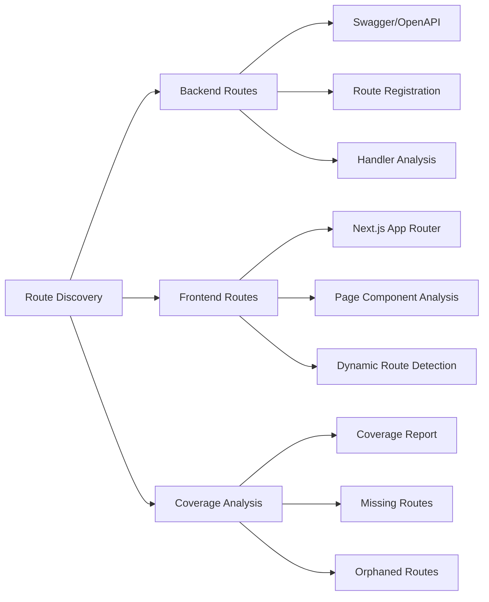

#### Manual Testing Checklist

##### Authentication Flow
- [ ] User registration with valid data
- [ ] User registration with invalid data
- [ ] User login with valid credentials
- [ ] User login with invalid credentials
- [ ] Password reset flow (email → reset → confirmation)
- [ ] JWT token refresh
- [ ] Session timeout handling
- [ ] Logout functionality

##### Product Management
- [ ] Product list view with pagination
- [ ] Product creation with valid data
- [ ] Product creation with invalid data
- [ ] Product detail view
- [ ] Product editing
- [ ] Product deletion
- [ ] Product search functionality
- [ ] Product image upload

##### Customer Management
- [ ] Customer list view
- [ ] Customer creation
- [ ] Customer detail view
- [ ] Customer editing
- [ ] Customer deletion
- [ ] Customer search
- [ ] Active customer filtering

##### Supplier Management
- [ ] Supplier list view
- [ ] Supplier creation
- [ ] Supplier detail view
- [ ] Supplier editing
- [ ] Supplier deletion
- [ ] Supplier search

##### Order Management
- [ ] Purchase order creation
- [ ] Purchase order listing
- [ ] Purchase order status updates
- [ ] Purchase order receiving
- [ ] Sales order creation
- [ ] Sales order listing
- [ ] Sales order status updates
- [ ] Sales order shipping

##### Inventory Management
- [ ] Inventory dashboard
- [ ] Stock level monitoring
- [ ] Batch tracking
- [ ] Location management
- [ ] Low stock alerts
- [ ] Expiring batch alerts

##### Reports and Analytics
- [ ] Dashboard KPIs
- [ ] Sales analytics
- [ ] Purchase analytics
- [ ] Inventory reports
- [ ] Export functionality (CSV)

##### File Management
- [ ] File upload functionality
- [ ] File viewing
- [ ] File deletion
- [ ] File URL generation
- [ ] File access control

##### Settings and Administration
- [ ] User profile management
- [ ] Password change
- [ ] Company settings
- [ ] User management (admin)
- [ ] Role-based access control

### Error Scenario Testing

#### Network Error Handling
- [ ] Connection timeout scenarios
- [ ] Server unavailable scenarios
- [ ] Partial response scenarios
- [ ] Rate limiting scenarios

#### Validation Error Handling
- [ ] Client-side validation
- [ ] Server-side validation
- [ ] Field-level error display
- [ ] Form-level error handling

#### Authorization Error Handling
- [ ] Unauthorized access attempts
- [ ] Insufficient permissions
- [ ] Expired token scenarios
- [ ] Role-based restrictions

## Performance Testing Framework

### Frontend Performance
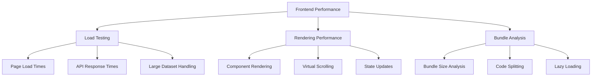

### Backend Performance
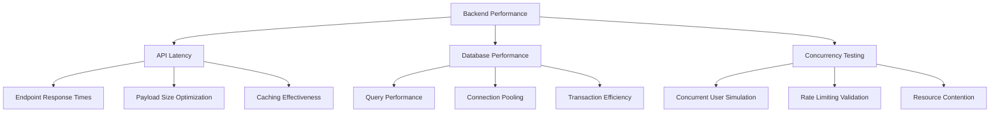

## Continuous Integration Integration

### CI/CD Pipeline
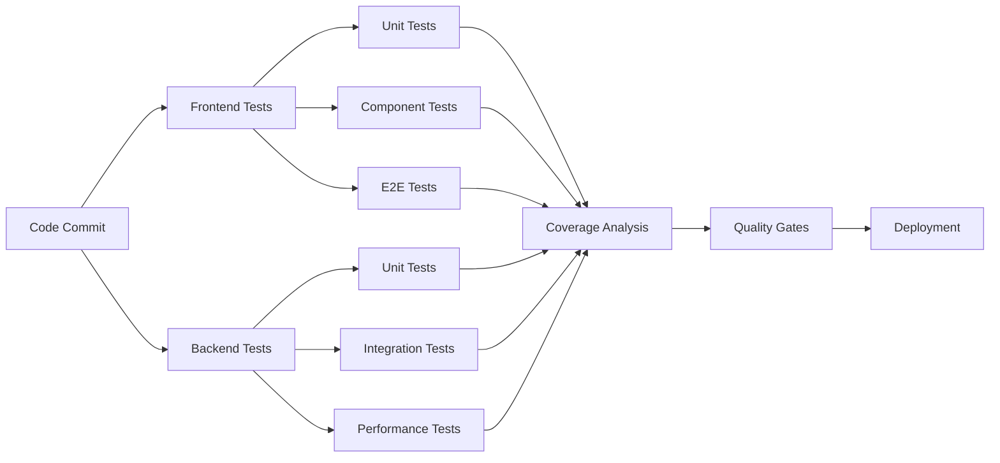

### Quality Gates
- **Frontend Coverage**: Minimum 85% line coverage
- **Backend Coverage**: Minimum 90% line coverage
- **E2E Test Success**: 100% critical path tests pass
- **Performance Benchmarks**: All endpoints under 500ms
- **Security Scans**: No high/critical vulnerabilities
- **Accessibility**: WCAG 2.1 AA compliance

## Implementation Timeline

### Phase 1: Foundation (Week 1-2)
- Set up comprehensive test infrastructure
- Implement missing critical frontend routes
- Create base test templates and utilities
- Establish CI/CD integration

### Phase 2: Core Testing (Week 3-4)
- Implement all unit tests for existing components
- Create comprehensive integration test suite
- Implement API contract tests
- Set up manual testing protocols

### Phase 3: Coverage Completion (Week 5-6)
- Implement remaining frontend routes
- Complete end-to-end test coverage
- Performance testing implementation
- Error scenario testing

### Phase 4: Validation and Optimization (Week 7-8)
- Manual verification of all routes
- Performance optimization
- Test suite optimization
- Documentation completion

## Success Metrics

### Coverage Metrics
- **Route Coverage**: 100% backend endpoints have frontend interfaces
- **Test Coverage**: >85% frontend, >90% backend
- **E2E Coverage**: 100% critical user journeys tested
- **API Contract Coverage**: 100% endpoints tested

### Quality Metrics
- **Zero Critical Bugs**: No unhandled errors in production flows
- **Performance**: All API endpoints <500ms, pages <2s load time
- **Accessibility**: WCAG 2.1 AA compliance across all interfaces
- **Security**: No vulnerabilities in authentication/authorization flows

### Maintenance Metrics
- **Test Execution Time**: Full suite <15 minutes
- **Test Reliability**: <1% flaky test rate
- **Coverage Drift**: <5% coverage loss between releases
- **Documentation Currency**: 100% test documentation up-to-date